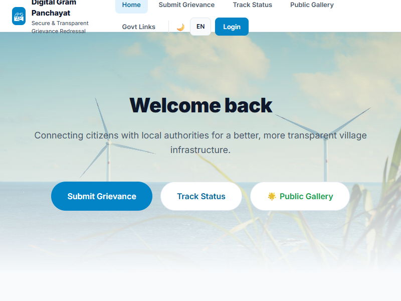

<p align="center">
  
</p>

<h1 align="center">🏘️ GramSeva — Digital Gram Panchayat</h1>

<p align="center">
  <strong>Secure & Transparent Village Grievance Redressal System</strong><br/>
  Connecting rural citizens with local authorities for accountable, trackable community issue resolution.
</p>

<p align="center">
  
  
  
  
  
  
  
</p>

<p align="center">
  
</p>

---

## 📋 Table of Contents

- [Overview](#-overview)
- [Key Features](#-key-features)
- [Architecture](#-architecture)
- [Tech Stack](#-tech-stack)
- [Getting Started](#-getting-started)
- [Environment Variables](#-environment-variables)
- [Project Structure](#-project-structure)
- [Security](#-security)
- [Contributing](#-contributing)
- [License](#-license)

---

## 🌍 Overview

**GramSeva** is a production-grade grievance redressal platform designed for Indian Gram Panchayats (village councils). It enables citizens to report local infrastructure issues — water supply, roads, sanitation, electricity — and track their resolution with full transparency.

Built for low-bandwidth, mobile-first environments, GramSeva works offline, supports voice input in **English, Hindi, and Telugu**, and routes complaints to the correct village authority using **GPS + PostGIS geofencing**.

### Who is this for?

| Role | Capabilities |
|------|-------------|
| **Citizens** | Submit grievances, upload photo evidence, track status via ticket ID, rate resolutions |
| **Anonymous Users** | File complaints without an account (rate-limited to prevent spam) |
| **Village Admins** | Manage complaints within their jurisdiction, assign officers, upload GeoJSON boundaries |
| **Super Admins** | Global oversight, approve admin requests, audit logs, cross-village analytics |

---

## ✨ Key Features

### Grievance Management
- 📝 **Multi-category complaints** — Road, Water, Electricity, Sanitation, Education, Health, Agriculture
- 🎫 **Unique ticket IDs** — Auto-generated `VGS-XXXXXXXX` format with collision protection
- 📸 **Photo evidence** — Upload up to 10 images (gallery + camera), drag-and-drop, with server-side access control
- 🎙️ **Voice input** — Speak complaints in English, Hindi, or Telugu
- ✏️ **Editable complaints** — Citizens can update Open/Assigned complaints with full audit history

### Smart Routing
- 📍 **GPS-based village detection** — PostGIS `ST_Within` automatically routes complaints to the correct jurisdiction
- 🗺️ **Cross-village filing** — Citizens can report issues in any village they visit; routing is separate from home village
- 🧭 **GeoJSON boundary management** — Admins upload and manage their village boundaries

### Transparency & Accountability
- 📊 **Real-time status tracking** — Open → Assigned → In Progress → Resolved → Closed pipeline
- ⏰ **7-day SLA enforcement** — Auto-escalation of overdue complaints
- ⭐ **Resolution ratings** — Citizens rate completed work
- 👍 **Community upvoting** — Prioritize high-impact issues
- 📋 **Full audit trail** — Every status change and edit is logged

### Accessibility
- 🌐 **Multilingual** — English, Hindi (हिन्दी), Telugu (తెలుగు)
- 📱 **PWA** — Installable on mobile, works offline with queue sync
- 🌙 **Dark mode** — Automatic and manual theme switching
- 📄 **PDF & Excel export** — Download complaint reports
- 🔗 **QR codes** — Share complaint tickets via scannable codes
- 🏛️ **Government scheme links** — Direct access to MGNREGA, PM Awas Yojana, Jal Jeevan Mission, etc.

---

## 🏗 Architecture

```
┌─────────────────────────────────────────────────────────────────────┐
│                         Client (React PWA)                         │
│  ┌──────────┐ ┌────────────┐ ┌──────────┐ ┌─────────────────────┐  │
│  │ Grievance │ │   Admin    │ │  Tracker │ │   Offline Queue     │  │
│  │   Form   │ │ Dashboard  │ │   View   │ │ (localStorage sync) │  │
│  └────┬─────┘ └─────┬──────┘ └────┬─────┘ └──────────┬──────────┘  │
│       └──────────────┼────────────┼──────────────────┘             │
│                      │            │                                │
└──────────────────────┼────────────┼────────────────────────────────┘
                       │            │
                  Supabase JS SDK (RLS-enforced)
                       │            │
┌──────────────────────┼────────────┼────────────────────────────────┐
│                 Supabase (PostgreSQL + PostGIS)                     │
│  ┌──────────────┐ ┌──────────────┐ ┌────────────────────────────┐  │
│  │  complaints  │ │   profiles   │ │   villages (+ GeoJSON)     │  │
│  │  (RLS ✓)     │ │   (RLS ✓)    │ │   (RLS ✓)                  │  │
│  └──────────────┘ └──────────────┘ └────────────────────────────┘  │
│  ┌──────────────┐ ┌──────────────┐ ┌────────────────────────────┐  │
│  │  audit_logs  │ │ rate_limits  │ │   complaint-evidence       │  │
│  │  (RLS ✓)     │ │  (RLS ✓)     │ │   (Storage bucket, RLS ✓) │  │
│  └──────────────┘ └──────────────┘ └────────────────────────────┘  │
│                                                                     │
│  Triggers: ticket_id generation, duplicate prevention, SLA engine  │
│  Functions: escalate_overdue, can_read_complaint_evidence           │
└─────────────────────────────────────────────────────────────────────┘
```

---

## 🛠 Tech Stack

| Layer | Technology |
|-------|-----------|
| **Frontend** | React 18, Vite 5, Tailwind CSS 4 |
| **Backend** | Supabase (PostgreSQL 15 + PostGIS) |
| **Auth** | Supabase Auth (Email OTP) |
| **Storage** | Supabase Storage (private bucket with RLS) |
| **Maps** | Leaflet + React-Leaflet |
| **i18n** | react-i18next (EN / HI / TE) |
| **Voice** | Web Speech API |
| **PDF/Export** | jsPDF + jspdf-autotable, xlsx |
| **Hosting** | Vercel |
| **Security** | Row Level Security (RLS) on all tables, rate limiting, audit logging |

---

## 🚀 Getting Started

### Prerequisites

- **Node.js** 18+ and **npm** 9+
- A **Supabase** project with PostGIS enabled

### Installation

```bash
# Clone the repository
git clone https://github.com/jaswantsurya-coder/villagegrievencesystem.git
cd villagegrievencesystem

# Install dependencies
npm install

# Set up environment variables (see below)
cp .env.example .env

# Start development server
npm run dev
```

The app will be available at `http://localhost:5173`.

### Production Build

```bash
npm run build
npm run preview
```

---

## 🔐 Environment Variables

Create a `.env` file in the project root:

```env
VITE_SUPABASE_URL=https://your-project.supabase.co
VITE_SUPABASE_ANON_KEY=your-anon-key-here
```

| Variable | Required | Description |
|----------|----------|-------------|
| `VITE_SUPABASE_URL` | ✅ | Your Supabase project URL |
| `VITE_SUPABASE_ANON_KEY` | ✅ | Supabase anonymous (public) key |
| `VITE_REQUEST_ADMIN_URL` | ❌ | URL for the admin request portal |
| `VITE_REPORT_BUGS_URL` | ❌ | URL for the bug reporting portal |
| `VITE_FEEDBACK_URL` | ❌ | URL for the user feedback portal |

> **⚠️ Security Note:** The anon key is safe to expose in the frontend — it is restricted by Row Level Security policies. Never expose your `service_role` key.

---

## 📁 Project Structure

```
villagegrievencesystem/
├── App.jsx                  # Main application (all views & logic)
├── main.jsx                 # React entry point
├── index.html               # HTML shell with PWA + theme support
├── index.css                # Global styles
├── i18n.js                  # Internationalization (EN/HI/TE)
├── supabaseClient.js        # Supabase client initialization
├── vite.config.js           # Vite configuration
├── components/
│   └── ui/
│       └── sign-in.jsx      # Authentication component
├── public/
│   ├── manifest.json        # PWA manifest
│   ├── sw.js                # Service worker (offline support)
│   └── images/              # Static assets
└── package.json
```

---

## 🔒 Security

This project implements defense-in-depth security:

- **Row Level Security (RLS)** enabled on every application table
- **Rate limiting** — Anonymous complaints capped at 3/hour per phone number
- **Duplicate prevention** — Unique index on citizen + title + 5-minute time bucket
- **Photo evidence access control** — Custom `SECURITY DEFINER` function verifies village membership before granting read access
- **Audit logging** — All state changes are recorded in `audit_logs`
- **Environment isolation** — All secrets stored in environment variables, never committed to the repository
- **Input validation** — File type and size restrictions on photo uploads (5MB max, JPG/PNG/WEBP only)

### Reporting a Vulnerability

If you discover a security vulnerability, please email the maintainer directly rather than opening a public issue. See [SECURITY.md](SECURITY.md) for details.

---

## 🤝 Contributing

Contributions are welcome! Please see our [Contributing Guide](CONTRIBUTING.md) for details on:

- Setting up your development environment
- Code style and conventions
- Submitting pull requests
- Reporting bugs

---

## 📄 License

This project is licensed under the **MIT License** — see the [LICENSE](LICENSE) file for details.

---

<p align="center">
  Made with ❤️ for Indian villages<br/>
  <strong>GramSeva</strong> — Every village voice matters
</p>
